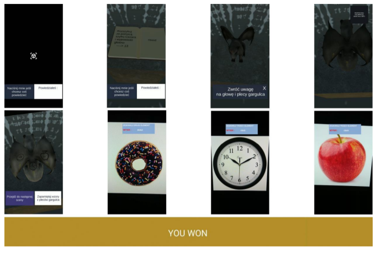

# Features

Thesis project. It's a combination of ARCore, Tensorflow and Google Speech to Text API.

Object recognition made by Syn-McJ : https://github.com/Syn-McJ/TFClassify-Unity
Google Speech to Text API made by MatthewHallberg : https://github.com/MatthewHallberg/AndroidSpeechToText

